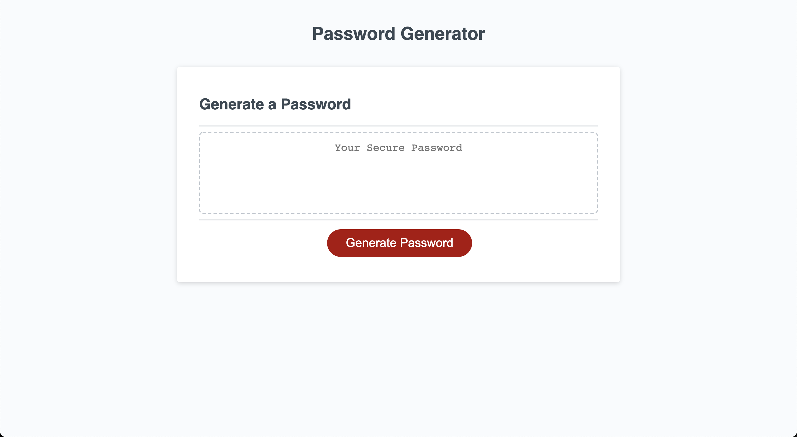

# Password Generator

## Description
This project uses Javascript to generate a random password based on the user's answers to a series of prompts. 
When the user clicks on the "Generate Password" button they receive a series of prompts to confirm password length and types of characters included. 
Once all of the prompts are answered, the randomly generated password is displayed on the screen for the user to copy. 

## Screenshot

## Application URL
[Link to Deployed Application](https://thebsking.github.io/password-generator/)

